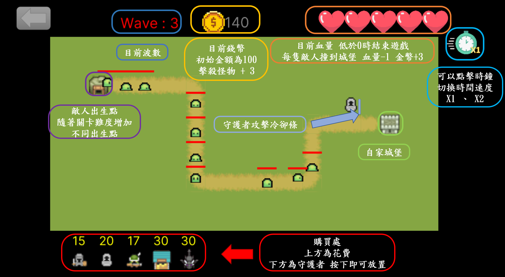

# 2025 OOPL Final Report

## 組別資訊

組別：28
組員：112820003辛政隆、112820025陳翊揚
復刻遊戲：國王保衛戰

## 專案簡介

### 遊戲簡介
> 要塞守護是一款類似`國王保衛戰`，放置守護者來攻擊怪物，擊敗怪物後獲得的金幣可以購買新的守護者或是升級守護者。隨者敵人波數及關卡難度增加，怪物的血量及數量也會增加，還會出現不同型態的敵人。 
特色在於多種進攻路線與隨關卡變化的地形限制，考驗玩家配置與資源分配策略。

### 組別分工
| 工作項目 | 112820003 辛政隆 | 112820025 陳翊揚|
|----------|------------------------------|----------------------------------|
| 地圖製作 | 研究如何使用Tiled、利用製作Tile、收集圖片檔案 | 設計地圖、轉換成地圖代碼           |
| 物件製作 | 製作 Guard、Enemy             | 製作 SceneManager、UI 類別(Button、Heart)      |
| 讀檔製作 | 設計 ReadEnemy、ReadWaypoint  | 製作 Read 相關架構                |
| 關卡製作 | 設計敵人種類及波數             | 製作關卡 UI                       |
| 動畫製作 | 整理並切割找到的素材圖片        | 製作子彈及角色動畫                 |

## 遊戲介紹

### 遊戲規則
我們有製作遊戲說明，可以點擊`遊戲說明`查看以下內容。 

### 遊戲畫面
> **遊戲首頁**，點擊`開始遊戲`進入關卡選擇畫面，點擊`遊戲說明`可以進入教學說明。

> **選擇關卡畫面**，有1~15關以及無盡模式，共16種關卡

> **這是遊戲畫面(以第二關舉例)**

## 程式設計

### 程式架構

### 程式技術

## 結語

### 問題與解決方法
### 自評

| 項次 | 項目                   | 完成 |
|------|------------------------|-------|
| 1    | 完成專案權限改為 public |    |
| 2    | 具有 debug mode 的功能  |    |
| 3    | 解決專案上所有 Memory Leak 的問題  | ✔ |
| 4    | 報告中沒有任何錯字，以及沒有任何一項遺漏  |  |
| 5    | 報告至少保持基本的美感，人類可讀  | ✔ |

### 心得
### 貢獻比例