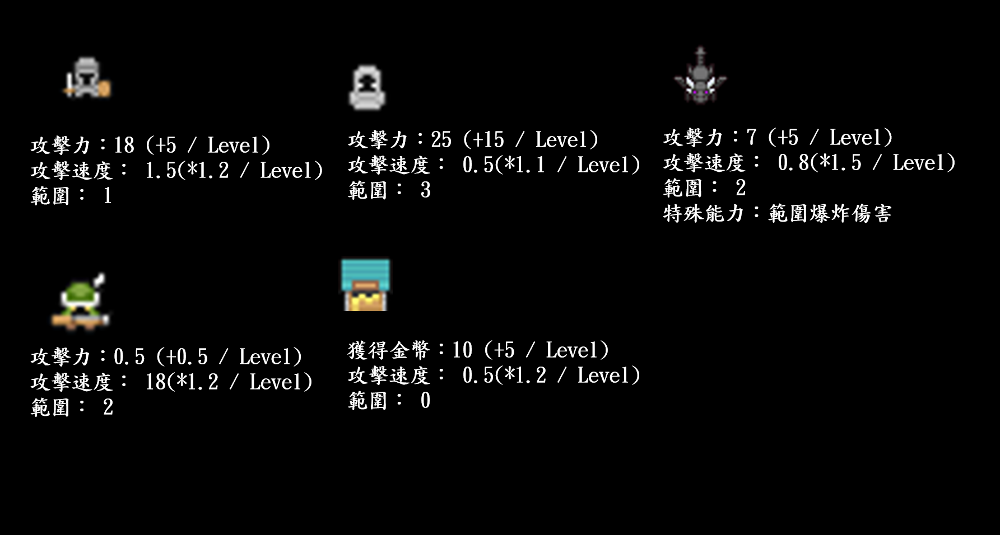

# 2025 OOPL Final Report

## debug mode 說明
> 對一隻守衛者點左鍵後，可以按`U`無限升級、不耗金幣。
## 組別資訊

組別：28  
組員：112820003辛政隆、112820025陳翊揚  
復刻遊戲：王國保衛戰

## 專案簡介

### 遊戲簡介
> 要塞守護是一款類似`王國保衛戰`，放置守護者來攻擊怪物，擊敗怪物後獲得的金幣可以購買新的守護者或是升級守護者。隨著敵人波數及關卡難度增加，怪物的血量及數量也會增加，還會出現不同型態的敵人。 
特色在於多種進攻路線與隨關卡變化的地形限制，考驗玩家配置與資源分配策略。

### 組別分工
| 工作項目 | 112820003 辛政隆 | 112820025 陳翊揚|
|----------|------------------------------|----------------------------------|
| 地圖製作 | 研究如何使用Tiled、利用製作Tile、收集圖片檔案 | 設計地圖、轉換成地圖代碼           |
| 物件製作 | 製作 Guard、Enemy             | 製作 SceneManager、UI 類別(Button、Heart)      |
| 讀檔製作 | 設計 ReadEnemy、ReadWaypoint  | 製作 Read 相關架構                |
| 關卡製作 | 設計敵人種類及波數             | 製作關卡 UI                       |
| 動畫製作 | 整理並切割找到的素材圖片        | 製作子彈及角色動畫                 |

## 遊戲介紹

### 遊戲規則
我們有製作遊戲說明，可以點擊`遊戲說明`查看以下內容。 

### 遊戲畫面
> **遊戲首頁**，點擊`開始遊戲`進入關卡選擇畫面，點擊`遊戲說明`可以進入教學說明。

> **選擇關卡畫面**，有1~15關以及無盡模式，共16種關卡

> **這是遊戲畫面(以第二關舉例)**

## 程式設計

### 程式架構

### 程式技術
1. **CSV 資料載入器 (ReadWaypoint、ReadEnemy、ReadMap)**
  > - 利用 STL `ifstream` + `stringstream` 實作通用 CSV 解析器，配合 RAII 自動關閉檔案。
  > - 在`ReadMap`內可讀取事先製作的地圖代碼，讓我們可以直接套用事先切割好的圖，並且可以更方便設計、修改地圖。
  > - 在`ReadWaypoint`內採用儲存巢狀 `std::vector`，來儲存事先規劃好的不同路線。
  > - 在`ReadEnemy`上支援可以分辨不同的敵人種類以及不同路線，讓我們創造關卡時，可以在敵人種類、敵人進攻路線上更多元，坐起來也更方便修改。
2. **事件驅動 UI 與 Lambda Callback**
  > - UI 採事件驅動設計，`Button` 內部綁定 lambda callback，提高此物件的複用度。
  > - 每個按鈕只會注意自身行為，畫面與邏輯鬆耦合，方便最後把 UI 套件化。
  > - UI 成為父類別，將所有物件丟進一個UI的vector當中一起渲染即可，不用單一物件渲染。

3. **可調倍速的遊戲時鐘**
  > - `gameSpeed` 影響所有與時間有關的計數器（Wave 間隔、子彈冷卻…），點擊 UI 即時在 1×/2× 間切換。
  > - 不增加 GPU 負擔、利用乘法的方式讓冷卻減半或是攻速加倍。

## 結語

### 問題與解決方法
### 自評

| 項次 | 項目                   | 完成 |
|------|------------------------|-------|
| 1    | 完成專案權限改為 public  | ✔ |
| 2    | 具有 debug mode 的功能  | ✔ |
| 3    | 解決專案上所有 Memory Leak 的問題  | ✔ |
| 4    | 報告中沒有任何錯字，以及沒有任何一項遺漏  | ✔ |
| 5    | 報告至少保持基本的美感，人類可讀  | ✔ |

### 心得
**112820003 辛政隆**  
這次遊戲製作，是我第一次從頭設計並實作出一款具備完整玩法的塔防遊戲，過程中充滿挑戰但也收穫滿滿。

我主要負責了遊戲中的Guard與Enemy類別設計，一開始學習Tiled的使用來設計地圖，到規劃敵人種類與波數邏輯。同時，我也嘗試實作角色攻擊邏輯，像是射程判定去決定是否攻擊，還有敵人移動的路徑，這對我來說是一個OOP實作上非常實用的經驗。整體來說，我認為自己在物件導向設計的邏輯、程式的思維上都有進步。

過程中也遇到不少bug，例如角色攻擊邏輯判斷失效、敵人血量異常等，但透過不斷測試與組員協作，我學到了如何定位問題、如何拆解問題，再測關鍵流程debug，也讓我未來開發時更有信心。

這次專題不只是一次程式實作的練習，更是對我整理邏輯思維、分工合作、以及耐心解決問題的挑戰。很高興能完成一款這麼完整的作品，並與組員一起把它變成一款有趣又可玩的遊戲！

**112820025 陳翊揚**  
這次「要塞守護」的專題製作，是我在程式設計課程中最具挑戰與成就感的一次經驗。作為主要負責 UI、動畫效果與場景流程控制的我，這段時間不只是把功能做出來，而是努力讓它更有「遊戲感」。

我從一開始就負責 SceneManager 與各個 Scene 的串接，讓玩家可以從首頁流暢進入關卡、遊戲畫面與教學畫面。特別是 UI 設計上，花了很多心思在使用者體驗上：不只是讓按鈕能點擊，而是讓它能和其他邏輯結合，甚至用 lambda callback 增加模組化程度，這讓我對事件驅動式程式設計有了很大的體會。

我也負責了角色與敵人的動畫處理，從素材整理到實際渲染，包含不同角色（如 Mage、Dragon）與敵人（如 MegaSlime、Necromancer）的動作設計以及子彈運作，這段過程讓我知道美術與邏輯之間的協調有多重要。

另外，我還幫忙設計關卡選單與 UI 呈現，並在後期加入教學說明、波數顯示、冷卻計數等功能。這些雖然不一定是最「核心」的邏輯，但卻大大提升了整體遊戲體驗，也讓我對「產品的完整度」有了不同的認識。

這次專題合作讓我更了解團隊協作的重要性，也從辛政隆同學那邊學到了很多程式架構的設計方法。希望未來還有機會再一起開發一款屬於我們自己的遊戲並上架，可以讓我們同學可以一起玩！
### 貢獻比例
|   學號名字     |比例     |
|---------------|--------| 
|112820003 辛政隆|50%| 
|112820025 陳翊揚|50%|