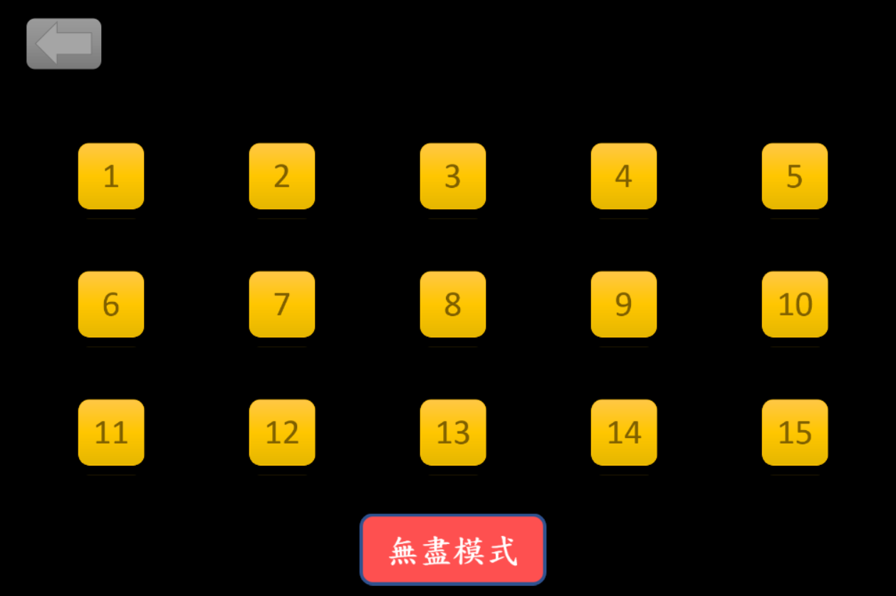
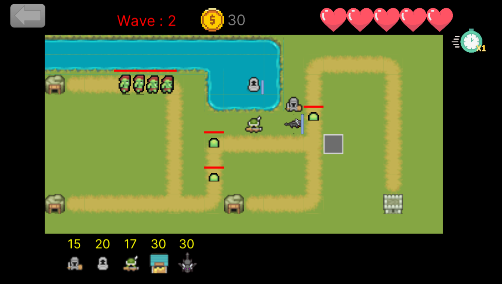
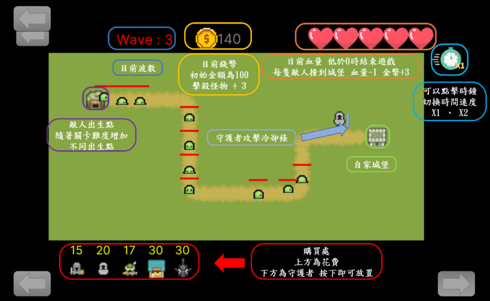
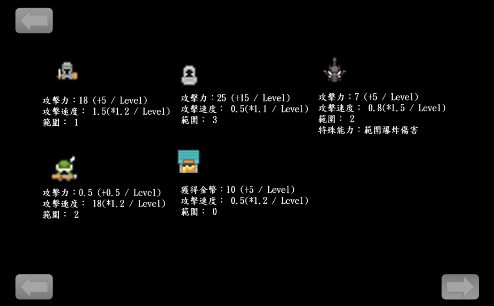
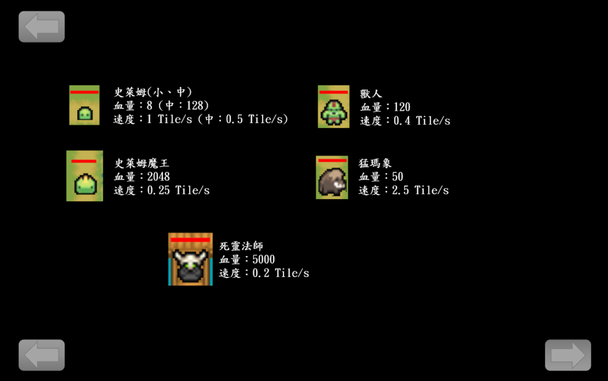
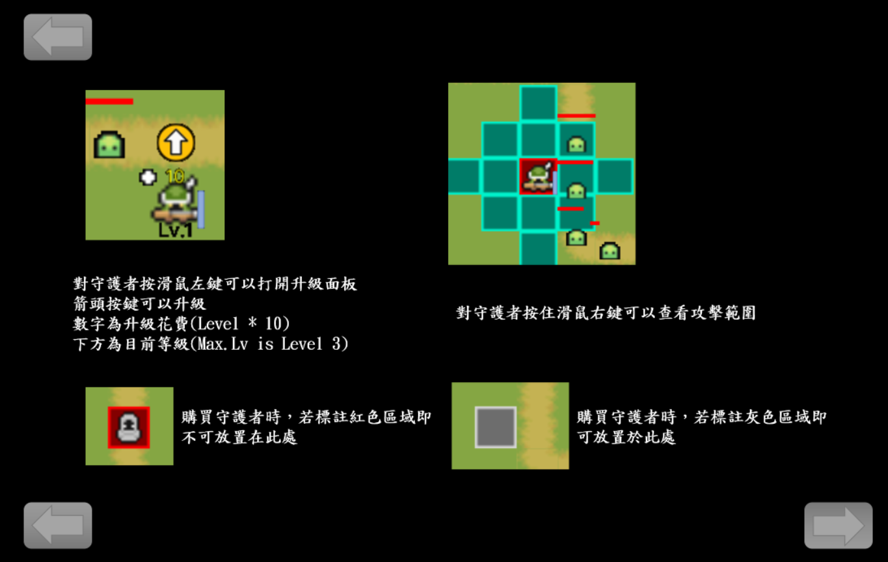

# Fortress Guard

以 C++17 與 [PTSD](https://github.com/ntut-open-source-club/practical-tools-for-simple-design) 框架開發的塔防遊戲，為臺北科技大學 OOP 實驗課程專題。

## 介面截圖

### 主選單


### 關卡選擇
共 15 關一般關卡，以及底部的**無盡模式**。



### 遊戲畫面
上方顯示當前波數、持有金幣與剩餘城堡血量；下方購買欄顯示各守衛費用與圖示；右上角時鐘按鈕可切換 ×1 / ×2 遊戲速度。



### 遊戲說明

| UI 介紹 | 守衛數值 |
|:---:|:---:|
|  |  |
| **敵人數值** | **操作說明** |
|  |  |

---

## 遊戲玩法

在 10×20 的格子地圖上部署守衛，阻擋沿固定路徑前進的敵人。玩家初始擁有 **5 顆城堡之心** 與 **100 金幣**，每當敵人抵達終點就失去一顆心，擊敗敵人可獲得 3 金幣。

- **波次系統** — 敵人分波出現，全數波次存活即獲勝
- **加速切換** — 點擊右上角時鐘按鈕可切換 ×1 / ×2 遊戲速度
- **守衛升級** — 左鍵點擊已部署的守衛開啟升級面板，最高 3 階（Max Lv.3）

## 守衛

| 守衛 | 費用 | 攻擊力 | 攻擊速度 | 攻擊範圍 | 升級加成 |
|---|---|---|---|---|---|
| 劍士（Swordsman） | 15 | 18 | 1.5 | 1 | +5 攻擊力，×1.2 速度 / 階 |
| 法師（Mage） | 20 | 25 | 0.5 | 3 | +15 攻擊力，×1.1 速度 / 階 |
| 火槍手（Musketeer） | 17 | 0.5 | 18 | 2 | +0.5 攻擊力，×1.2 速度 / 階 |
| 龍（Dragon） | 30 | 7 | 0.8 | 2 | +5 攻擊力，×1.5 速度 / 階；**範圍爆炸傷害** |
| 市場（Market） | 30 | — | — | 0 | 每次攻擊獲得 10 金幣（+5 / 階） |

升級費用公式：`10 × 當前階數 + (階數-3)(階數-2)(階數-1)`

## 敵人

| 敵人 | HP | 速度（Tile/s） | 特殊能力 |
|---|---|---|---|
| 史萊姆（Slime） | 8 | 1.0 | 基礎單位 |
| 中史萊姆（MegaSlime） | 128 | 0.5 | 死亡後分裂成 4 隻史萊姆 |
| 史萊姆魔王（SlimeKing） | 2048 | 0.25 | 精英 Boss |
| 獸人（Orc） | 120 | 0.4 | 裝甲戰士 |
| 猛瑪象（Mammoth） | 50 | 2.5 | 高速突擊 |
| 死靈法師（Necromancer） | 5000 | 0.2 | 每 1000 幀召喚一隻中史萊姆 |

## 架構

本專案以抽象基底類別與多型實作標準 OOP 設計。

```
Guard（抽象）
├── Swordsman
├── Mage
├── Musketeer
├── Dragon
└── Market

Enemy（抽象）
├── Slime
├── MegaSlime
├── Mammoth
├── Orc
├── SlimeKing
└── Necromancer

Scene（抽象）
├── StartScene
├── ChooseLevelScene
├── TutorialScene
└── Level
```

`SceneManager` 以堆疊管理場景切換與疊加。地圖配置、敵人出現順序與路徑點分別由 `ReadMap`、`ReadEnemy`、`ReadWayPoint` 從外部資料檔讀取。

## 建置方式

### 環境需求

- CMake 3.16+
- C++17 編譯器（Windows 上建議使用 MSVC 或 MinGW/GCC）
- 網路連線（CMake 會透過 `FetchContent` 自動下載 PTSD v0.2）

### 步驟

```sh
# 設定（建議使用 Debug 模式）
cmake -DCMAKE_BUILD_TYPE=Debug -B build

# 編譯
cmake --build build
```

> **注意：** 請以 `Debug` 模式執行，`RESOURCE_DIR` 才會指向原始碼中的 `Resources/` 資料夾。`Release` 模式下，程式會預期 `Resources/` 位於執行檔旁邊。

### 打包（Windows ZIP）

```sh
cmake --build build --config Release
cd build
cpack
```

執行後會產生 `FortressGuard-1.0.0-win64.zip`，包含執行檔與所有資源。

## 操作說明

| 動作 | 輸入 |
|---|---|
| 購買守衛 | 點擊商店中的守衛按鈕，再點擊地圖上的目標格子 |
| 取消購買 | 點擊取消按鈕 |
| 升級守衛 | 左鍵點擊已部署的守衛，再按升級箭頭 |
| 查看攻擊範圍 | 對守衛按住滑鼠右鍵 |
| 切換遊戲速度 | 點擊右上角時鐘按鈕（×1 / ×2） |
| 返回選單 | 點擊左上角返回按鈕 |

> 紅色邊框格子不可放置守衛；灰色邊框格子可放置。

## 專案結構

```
Fortress_Guard/
├── src/            # 原始碼（.cpp）
├── include/        # 標頭檔（.hpp）
├── Resources/      # 圖片、地圖、字型等資源
├── pictures/       # README 截圖
├── CMakeLists.txt
└── files.cmake     # 來源檔列表
```

## 授權

詳見 [LICENSE](LICENSE)。
